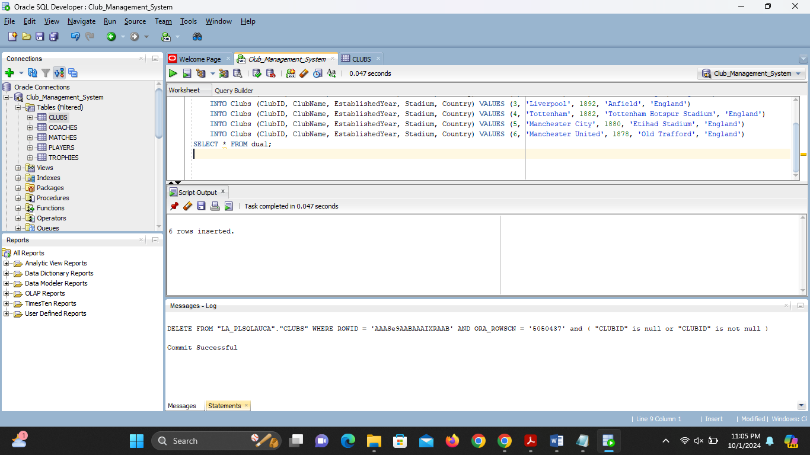

# Football Club Management Database

## Problem Statement

The system manages football clubs, addressing the need for efficient tracking of clubs,
players, coaches, matches, and trophies. Managing these aspects manually becomes 
overwhelming as the data grows, especially for league organizers, club administrators,
and analysts. The database provides a structured and scalable solution for storing and
retrieving information related to:

- **Clubs**: Details about football clubs including their stadiums and establishment years.
- **Players**: Player information such as name, position, nationality, and club association.
- **Coaches**: Records of coaches and their assigned clubs.
- **Matches**: Information on matches played between clubs, including scores and stadiums.
- **Trophies**: Details of trophies won by the clubs, such as the year and competition name.

##Connecting to database

##Conceptual Diagram

## SQL Commands Executed

The SQL commands executed in this project include creating tables for managing football clubs, 
inserting data for clubs, players, coaches, matches, and trophies, and performing various 
operations like updating and deleting records. Key SQL operations used in this project:

- **DDL (Data Definition Language)**: Creating tables such as `Clubs`, `Players`, `Coaches`, `Matches`, and `Trophies`.
- **DML (Data Manipulation Language)**: Inserting, updating, and deleting records in the tables.
- **DCL (Data Control Language)**: Granting privileges to users.
- **TCL (Transaction Control Language)**: Managing transactions to ensure data integrity.

### Example SQL Commands

-- Creating tables

--Inserting Data into tables
--Table Clubs

--Table Players

--DML operations on table players

--Performing Inner Join to get players first name,last name and club name

--performing outer join to get clubs and their coaches including clubs with no coaches

[def]: images/Club_ManagementModel.png